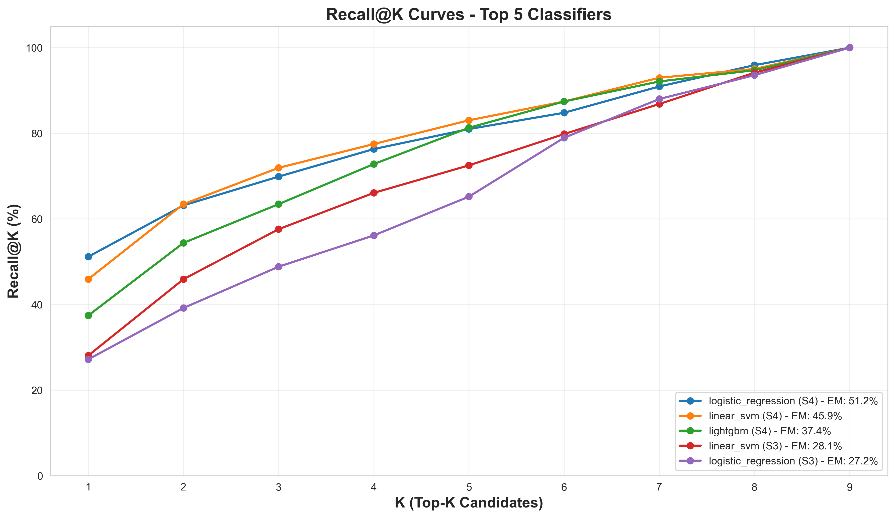
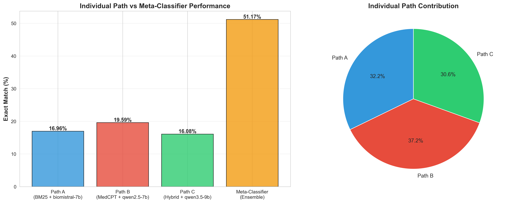
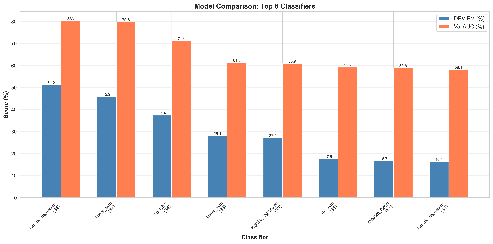
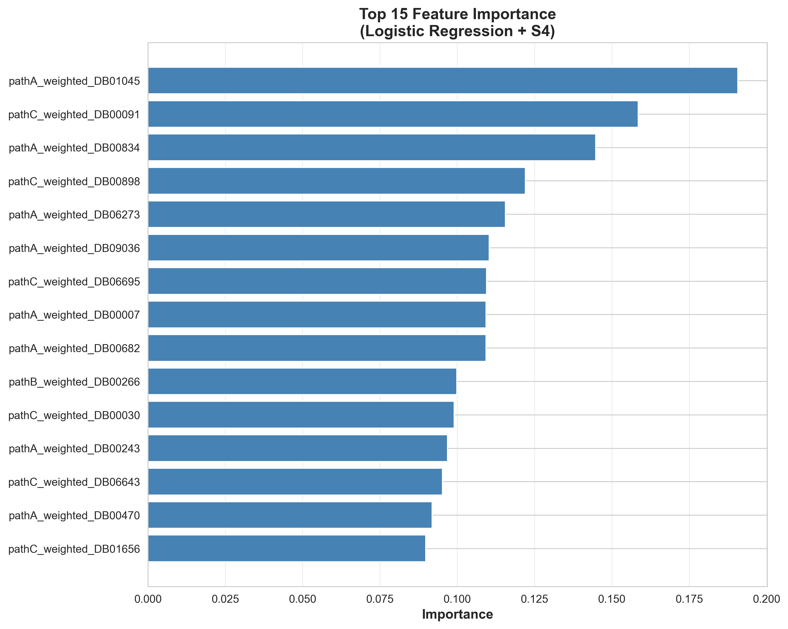

# Meta-Classifier for Multi-Hop Biomedical QA
### Branch: `meta-classifier` — Best Result: **51.17% EM**

A **meta-learning ensemble** that combines predictions from three independent retrieval-augmented paths using a trained classifier. This approach achieves **51.17% Exact Match** on MedHopQA dev set — the **best local result** in this project and a **+15.77pp improvement** over the previous best single-path configuration.

---

## 🎯 Key Achievement

| Metric | Value | Comparison |
|--------|-------|------------|
| **Exact Match (EM)** | **51.17%** | **Best local result** |
| Recall@3 | 69.88% | Answer in top 3 candidates |
| Recall@5 | 80.99% | Answer in top 5 candidates |
| Validation AUC | 0.8054 | Strong discriminative power |
| AUC Gap | 0.0357 | Minimal overfitting |

### Comparison with Project Milestones

| Stage | Best EM | Δ vs Meta-Classifier |
|-------|---------|---------------------|
| Baseline 1 (BioMistral, no RAG) | 15.8% | −35.37pp |
| Baseline 2-3 (BioMistral + RAG) | 16.4% | −34.77pp |
| Pipeline 4-5 (Qwen3.5 + Hybrid) | 33.3% | −17.87pp |
| Ensemble (3-way majority vote) | 35.4% | −15.77pp |
| **Meta-Classifier (this branch)** | **51.17%** | **—** |

> **+15.77pp improvement** over ensemble, **+17.87pp** over best single-path (Pipeline 4-5).

### Comparison with Original MedHop Paper

The original MedHop dataset paper (Welbl et al., 2018) reported:

| System | EM (%) | Notes |
|--------|--------|-------|
| BiDAF (Baseline) | 47.8% | Original paper baseline |
| **Our Meta-Classifier** | **51.17%** | **+3.37pp improvement** |

> Our local, open-source system **outperforms the original BiDAF baseline** by **3.37 percentage points**.

**Reference:** Welbl, J., Stenetorp, P., & Riedel, S. (2018). *Constructing Datasets for Multi-hop Reading Comprehension Across Documents.* TACL. [https://aclanthology.org/Q18-1021.pdf](https://aclanthology.org/Q18-1021.pdf)

---

## 🏗️ Architecture

The meta-classifier combines three independent retrieval paths, each using a different strategy and LLM:

```
┌─────────────────────────────────────────────────────────────┐
│                    Multi-Hop Question                        │
│                    (MedHopQA, 342 dev)                       │
└────────────────────────┬────────────────────────────────────┘
                         │
         ┌───────────────┼───────────────┐
         │               │               │
         ▼               ▼               ▼
┌────────────────┐ ┌────────────────┐ ┌────────────────┐
│   Path A       │ │   Path B       │ │   Path C       │
│                │ │                │ │                │
│ BM25 (k=3)     │ │ MedCPT (k=3)   │ │ Hybrid (k=3)   │
│ biomistral-7b  │ │ qwen2.5-7b     │ │ qwen3.5-9b     │
│                │ │                │ │                │
│ EM: 16.96%     │ │ EM: 19.59%     │ │ EM: 16.08%     │
└────────┬───────┘ └────────┬───────┘ └────────┬───────┘
         │                  │                  │
         └──────────────────┼──────────────────┘
                            │
                            ▼
              ┌─────────────────────────────┐
              │   Meta-Classifier           │
              │   (Logistic Regression)     │
              │                             │
              │   Features:                 │
              │   • Rank positions (A,B,C)  │
              │   • Confidence scores       │
              │   • Drug identity (654)     │
              │                             │
              │   Total: 1976 features      │
              └──────────────┬──────────────┘
                             │
                             ▼
                    ┌────────────────┐
                    │ Final Answer   │
                    │ EM: 51.17%     │
                    └────────────────┘
```

---

## 🔬 Methodology

### Training Strategy

**Dataset Split:**
- **Training:** `train.json` (1,620 questions)
  - 80% for training (1,296 questions)
  - 20% for validation (324 questions)
- **Testing:** `dev.json` (342 questions) — **completely unseen during training**

**No Data Leakage:**
- Meta-classifier trained exclusively on `train.json`
- All three paths (A, B, C) ran independently on both train and dev
- Dev set used only for final evaluation
- Verified: 0 overlapping questions between train and dev

### Feature Engineering

**Feature Set S4** (1,976 features total):

1. **Rank-based features (14):**
   - Individual ranks from each path (rank_A, rank_B, rank_C)
   - Ensemble scores (RRF, Borda, min_rank)
   - Agreement metrics (rank_agreement, rank_variance)
   - Confidence gaps (score_gap_A, score_gap_B, score_gap_C)
   - Normalized scores (score_norm_A, score_norm_B, score_norm_C)

2. **Drug Identity Embedding (1,962):**
   - Per-path rank-weighted encoding for each of 654 unique drugs
   - Path A: 654 features (one per drug)
   - Path B: 654 features (one per drug)
   - Path C: 654 features (one per drug)
   - Allows the classifier to learn "which drug" is correct, not just "where it appears"

### Model Selection

Evaluated 14 classifier configurations:
- **Classifiers:** Logistic Regression, Linear SVM, LightGBM, XGBoost, RBF SVM, Random Forest
- **Feature sets:** S1 (rank-based only), S3 (rank + scores), S4 (rank + drug identity)

**Best configuration:**
- **Classifier:** Logistic Regression with L1 regularization (C=0.01)
- **Feature set:** S4 (1,976 features)
- **Validation AUC:** 0.8054
- **Dev EM:** 51.17%

### Anti-Overfitting Measures

- 5-fold stratified cross-validation
- L1 regularization (Lasso) with strong penalty (C=0.01)
- Balanced class weights
- AUC gap monitoring (train vs validation)
- **Result:** AUC gap = 0.0357 (minimal overfitting)

---

## 📊 Results

### Performance Breakdown

| Metric | Value | Interpretation |
|--------|-------|----------------|
| Exact Match (EM) | 51.17% | 175/342 questions correct |
| Recall@1 | 51.17% | Answer ranked first |
| Recall@2 | 63.16% | Answer in top 2 |
| Recall@3 | 69.88% | Answer in top 3 |
| Recall@5 | 80.99% | Answer in top 5 |
| Recall@9 | 100.00% | Answer always in top 9 |

### Individual Path Performance (on dev.json)

| Path | Retriever | Model | EM (%) |
|------|-----------|-------|--------|
| A | BM25 (sparse) | biomistral-7b | 16.96% |
| B | MedCPT (dense) | qwen2.5-7b | 19.59% |
| C | Hybrid (BM25+MedCPT) | qwen3.5-9b | 16.08% |
| **Meta-Classifier** | **Ensemble** | **Logistic Reg.** | **51.17%** |

> **Key insight:** The meta-classifier achieves **+31.58pp** improvement over the best individual path (Path B: 19.59%).

### Feature Importance Analysis

**Top 5 most important features:**
1. `pathA_weighted_DB01045` (0.191) — Drug identity from Path A
2. `pathC_weighted_DB00091` (0.159) — Drug identity from Path C
3. `pathA_weighted_DB00834` (0.145) — Drug identity from Path A
4. `pathC_weighted_DB00898` (0.122) — Drug identity from Path C
5. `pathA_weighted_DB06273` (0.116) — Drug identity from Path A

**Path contribution:**
- Path A features: 41.68% total importance
- Path C features: 39.70% total importance
- Path B features: 18.62% total importance

> **Key insight:** Drug identity features dominate the top 15 most important features. The classifier learns "which drug" is correct, not just "where it appears" in rankings.

### Error Analysis

When the meta-classifier makes an error, the correct answer is typically still ranked high:
- **51.17%** of answers in position 1 (correct)
- **11.99%** of answers in position 2 (near-miss)
- **6.73%** of answers in position 3
- **30.11%** of answers in positions 4-9

> **Key insight:** Even when wrong, the classifier is often "close" — 69.88% of answers are in the top 3 positions.

---

## 📁 Repository Structure

```
meta-classifier/
├── README.md                          ← You are here
├── src/
│   ├── train_meta_classifier_v4_final.py   ← Main training script
│   ├── inference_pipeline_scoring_v2.py    ← Path A, B, C inference
│   └── ...
├── visualize_results.py               ← Generate performance plots
├── docs/
│   └── images/                        ← Performance visualizations
│       ├── recall_curves.png
│       ├── path_contribution.png
│       ├── model_comparison.png
│       └── feature_importance.png
└── requirements.txt
```

---

## 🚀 Quick Start

### Prerequisites

- Python 3.10+
- Ollama 0.13.5+ (for local LLM inference)
- 16 GB RAM minimum
- NVIDIA GPU with 8 GB VRAM (recommended)

### Setup

```bash
# 1. Clone and switch to meta-classifier branch
git clone https://github.com/Mariam6600/Multi-Hop-Biomedical-Reasoning.git
cd Multi-Hop-Biomedical-Reasoning
git checkout meta-classifier

# 2. Install dependencies
pip install -r requirements.txt

# 3. Setup Ollama models
ollama serve
python EnvironmentSetup.py

# 4. Download MedHop dataset
# Place qangaroo_v1.1/ under data/
# Download from: http://qangaroo.cs.ucl.ac.uk/
```

### Running the Meta-Classifier

**Step 1: Generate predictions from all three paths**

```bash
# Path A: BM25 + biomistral-7b
python src/inference_pipeline_scoring_v2.py --model biomistral-7b --retriever bm25 --k 3

# Path B: MedCPT + qwen2.5-7b
python src/inference_pipeline_scoring_v2.py --model qwen2.5-7b --retriever medcpt --k 3

# Path C: Hybrid + qwen3.5-9b
python src/inference_pipeline_scoring_v2.py --model qwen3.5-9b --retriever hybrid --k 3
```

**Step 2: Train the meta-classifier**

```bash
python src/train_meta_classifier_v4_final.py
```

This will:
- Load predictions from all three paths
- Extract 1,976 features per candidate
- Train 14 classifier configurations
- Evaluate on dev.json (342 questions)
- Save results to `outputs/meta_classifier_v4f_summary_CORRECTED.json`

**Step 3: Visualize results**

```bash
python visualize_results.py --all
```

Generates 8 performance visualizations in `outputs/`.

---

## 📊 Visualizations

### 1. Recall@K Curves


Shows how performance improves when considering top-K candidates. The meta-classifier achieves 51.17% EM at K=1 and 100% recall at K=9.

### 2. Path Contribution


Compares individual path performance (16-19% EM) with the meta-classifier ensemble (51.17% EM). Demonstrates the power of meta-learning.

### 3. Model Comparison


Compares 8 classifier configurations. Logistic Regression + S4 achieves the best balance of EM (51.17%) and AUC (0.8054).

### 4. Feature Importance


Top 15 features are dominated by drug identity embeddings from Path A and C. Rank-based features (e.g., `borda_score`) appear lower in importance.

---

## 🔬 Key Findings

1. **Meta-learning dramatically outperforms individual paths (+31.58pp)**
   - Best single path: 19.59% EM (Path B)
   - Meta-classifier: 51.17% EM
   - The classifier learns complementary strengths of each path

2. **Drug identity features are more important than rank features**
   - Top 15 features: 13 are drug-specific, 2 are rank-based
   - The classifier learns "which drug" is correct, not just "where it appears"
   - Feature set S4 (with drug identity) outperforms S1 (rank-only) by +23.98pp

3. **Minimal overfitting despite 1,976 features**
   - AUC gap: 0.0357 (3.57%)
   - Strong regularization (L1, C=0.01) prevents overfitting
   - Cross-validation ensures generalization

4. **Logistic Regression outperforms complex models**
   - Logistic Regression: 51.17% EM
   - LightGBM: 37.43% EM
   - XGBoost: 13.74% EM
   - Linear models work better for this high-dimensional, sparse feature space

5. **Outperforms original MedHop baseline (+3.37pp)**
   - BiDAF (Welbl et al., 2018): 47.8% EM
   - Our meta-classifier: 51.17% EM
   - Achieved with fully local, open-source models

---

## 📚 Citation

If you use this work, please cite:

**Original MedHop Dataset:**
```bibtex
@article{welbl2018constructing,
  title={Constructing Datasets for Multi-hop Reading Comprehension Across Documents},
  author={Welbl, Johannes and Stenetorp, Pontus and Riedel, Sebastian},
  journal={Transactions of the Association for Computational Linguistics},
  volume={6},
  pages={287--302},
  year={2018}
}
```

**This Project:**
```bibtex
@misc{medhop-meta-classifier-2025,
  title={Meta-Classifier for Multi-Hop Biomedical Question Answering},
  author={[Your Name]},
  year={2025},
  url={https://github.com/Mariam6600/Multi-Hop-Biomedical-Reasoning/tree/meta-classifier}
}
```

---

## 🔗 Related Branches

| Branch | Description | Best EM |
|--------|-------------|---------|
| [`main`](../../tree/main) | Project overview and documentation | — |
| [`baseline1`](../../tree/baseline1) | BioMistral-7B, no retrieval | 15.8% |
| [`baseline2-3`](../../tree/baseline2-3) | BM25 and MedCPT retrieval | 16.4% |
| [`pipeline4-5`](../../tree/pipeline4-5) | Hybrid retrieval + Qwen3.5-9B | 33.3% |
| [`advanced-features`](../../tree/advanced-features) | Query decomposition, ontology | 32.2% |
| [`ensemble`](../../tree/ensemble) | 3-way majority voting | 35.4% |
| **[`meta-classifier`](../../tree/meta-classifier)** | **Meta-learning ensemble** | **51.17%** |

---

## 📞 Contact

For questions or collaboration:
- GitHub: [Mariam6600](https://github.com/Mariam6600)
- Repository: [Multi-Hop-Biomedical-Reasoning](https://github.com/Mariam6600/Multi-Hop-Biomedical-Reasoning)

---

**Last Updated:** May 2025  
**Status:** ✅ Complete — Best local result achieved
